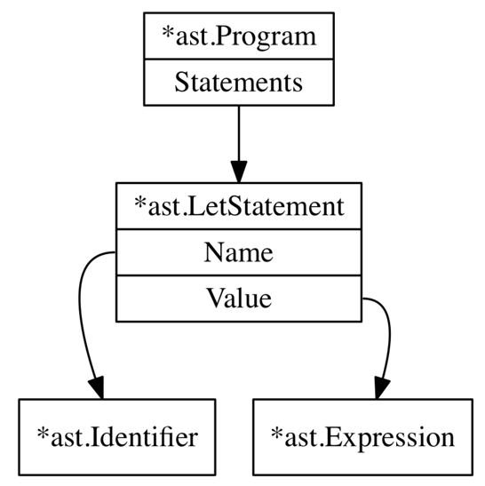
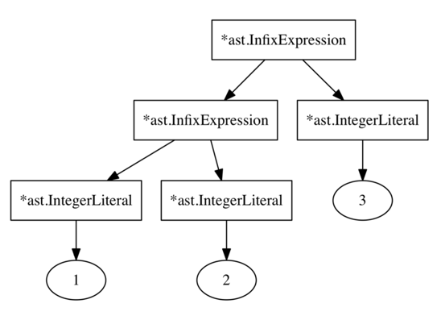
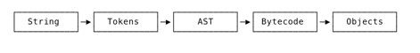
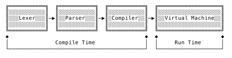

# Writing an interpreter and a compiler

Source: two great books `Writing an Interpreter in Go` and `Writing a Compiler in Go`
by Thorsten Ball

Monkey programming language
``` 
let one = 1;
let two = 2;
let result = one + two;
puts(result)
```

## Interpreter

``` 
Code (String)
--> Tokenizing with Lexer
Tokens
--> Parsing with Parser
AST
--> Evaluating with Tree-walking interpreter
Result
```

Data structures
- Token
- AST
- Lexer
- Parser
- `Environment`
  - keeping track of which name is mapped to which value e.g. `let x=5;`
  - HashMap[string, Object]
  - get(name: string) -> Option[Object]
  - set(name: string, obj: Object) -> Result<()>
  - pass to Eval `eval(ast.Node, Environment) -> Object`

Lexing 
- tokens
- lexer
- repl

Parsing
- top-down vs bottom-up parsing
  - top-down: constructing AST root node then descend
  - bottom-up: the other way around
- top-down variations
  - `recursive descent parsing/ Pratt parser` -> we write this
  - early parsing
  - predictive parsing
- parsing `let` statement
- parsing `return` statement
- parsing `expressions`

Evaluation with Tree-walking interpreter
- object system
- expressions evaluation `func Eval(node ast.Node) object.Object`
  - each ast node needs different evaluation which is implemented in this Eval function.
  - literals = self-evaluating expressions
    - boolean
    - integer
    - null
    - prefix (unary operator) expression e.g. `! -`
    - infix expression e.g. `+ - * / > < == !=`
  - conditionals
  - error handling
  - bindings (`let` statement, identifier evaluation)
  - functions & function calls
  - garbage collector: reusing Go's

``` 
//  evaluating expressions
Eval(*ast.Program)
-> Eval(*ast.Statement) for each Statement in *ast.Program.Statements
```

Extending
  - adding string support
  - built-in functions
  - arrays
  - hashmaps
  - output to STDOUT

    
ast for `let x=5;`



``` 
ast for parsing

1+2+3
```




---
## Compiler
```
Source Code (String)
--> Lexer
Tokens
-->Parser
AST
--> Optimizer (Compiler)
Internal Representation (Bytecode)
--> Code Generator (Virtual Machine)
Machine Code (Objects)
```

Data Structures
1. bytecode
2. instruction
3. vm
  - struct `Frame` (stack frame): data structure holding execution-relevant info.
  - struct `VM`: virtual machine holding (1) constant pool, (2) stack,
    a stack pointer pointing to next free slot in the stack.





Compile Time vs Run Time




## Terms
- infix operator
- prefix operator
- symbol table
- built-in function
- closure
- virtual machine: a computer built with software, mimics how a computer works

## References
Books
- Abelson, Harold and Sussman, Gerald Jay with Sussman, Julie. 1996. Structure and Interpretation of Computer Programs, Second Edition. MIT Press.
- Appel, Andrew W.. 2004. Modern Compiler Implementation in C. Cambridge University Press.
- Cooper, Keith D. and Torczon Linda. 2011. Engineering a Compiler, Second Edition. Morgan Kaufmann.
- Grune, Dick and Jacobs, Ceriel. 1990. Parsing Techniques. A Practical Guide.. Ellis Horwood Limited.
- Grune, Dick and van Reeuwijk, Kees and Bal Henri E. and Jacobs, Ceriel J.H. Jacobs and Langendoen, Koen. 2012. Modern Compiler Design, Second Edition. Springer
- Nisan, Noam and Schocken, Shimon. 2008. The Elements Of Computing Systems. MIT Press.

Papers
- Ayock, John. 2003. A Brief History of Just-In-Time. In ACM Computing Surveys, Vol. 35, No. 2, June 2003
- Ertl, M. Anton and Gregg, David. 2003. The Structure and Performance of Efficient Interpreters. In Journal Of Instruction-Level Parallelism 5 (2003)
- Ghuloum, Abdulaziz. 2006. An Incremental Approach To Compiler Construction. In Proceedings of the 2006 Scheme and Functional Programming Workshop.
- Ierusalimschy, Robert and de Figueiredo, Luiz Henrique and Celes Waldemar. The Implementation of Lua 5.0. https://www.lua.org/doc/jucs05.pdf
- Pratt, Vaughan R. 1973. Top Down Operator Precedence. Massachusetts Institute of Technology.
- Romer, Theodore H. and Lee, Dennis and Voelker, Geoffrey M. and Wolman, Alec and Wong, Wayne A. and Baer, Jean-Loup and Bershad, Brian N. and Levy, Henry M.. 1996. The Structure and Performance of Interpreters. In ASPLOS VII Proceedings of the seventh international conference on Architectural support for program- ming languages and operating systems.
- Dybvig, R. Kent. 2006. The Development of Chez Scheme. In ACM ICFP ’06