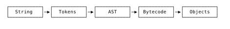
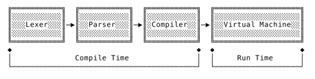

# Compiler

logical
```
Source Code (String)
--> Lexer
Tokens
-->Parser
AST
--> Optimizer (Compiler)
Internal Representation (Bytecode)
--> Code Generator (Virtual Machine)
Machine Code (Objects)
```

code
``` 
compiler = Compiler(ast.Program)
compiler.compile()
byte_code = compiler.byte_code()
vm = VM(byte_code)
VM.run()
```


opcode for stack VM to do stuff
1. `opconst`: push const (integer) to the stack
2. `oppop`
   - pop topmost element off the stack.
   - emit this opcode after expression stmt because it leaves unused value on the stack.
3. `opadd`: pop 2 things on the stack, add them, push result back
4. `opsub`
5. `opmul`
6. `opdiv`
7. `optrue`: can reuse opconst but it is a waste of bytes - need 2 bytes (opcode + value)
8. `opfalse`

boolean literals interpreter vs vm
- interpreter: evaluates to host language boolean values.
- vm: loads boolean values to the stack.

```
1 + 2;
  push 1
  push 2
  add
  
true;
    

Instruction: 
    0001 0011 1110 -> CONSTANT 0011 1110
    
Bytecode: 
    0001 -> CONSTANT
```


``` 
VM
    stack: List[Object]
    stack_pointer: int
    
    run() // processing different bytecodes
```

Terms
- opcode: byte
- instruction 
  - = opcode + [operand(s)]
  - contains many bytes, first byte is the operator, >= 0 operands.
- bytecode
  - a low-level representation of code typically generated by compilers or interpreters 
  - will be processed by a VM: translated into hosting CPU instruction.
- VM (Virtual Machine)
   - struct `Frame` (stack frame): data structure holding execution-relevant info.
   - struct `VM`: virtual machine holding (1) constant pool, (2) stack,
     a stack pointer pointing to next free slot in the stack.
     - stack
     - stack pointer

Types
- opcode
  - rust: u8
  - go: byte
- instruction
  - rust: [u8] byte slice
  - go: []byte
- bytecode
  - struct contains compiled instructions and constants
- compiler
  - struct
- vm
  - struct


## Diagrams

compiling dataflow




Compile Time vs Run Time


