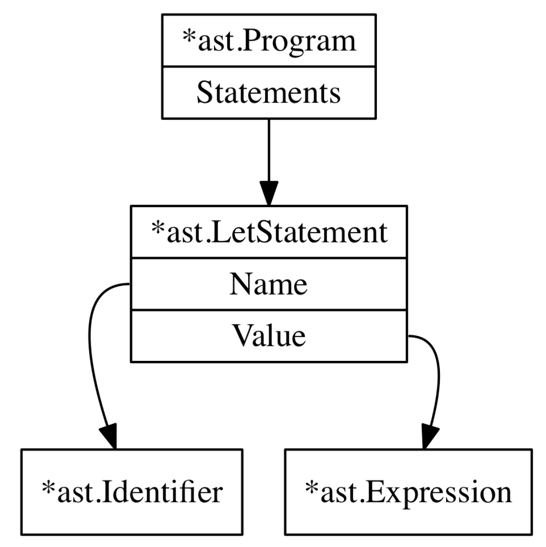
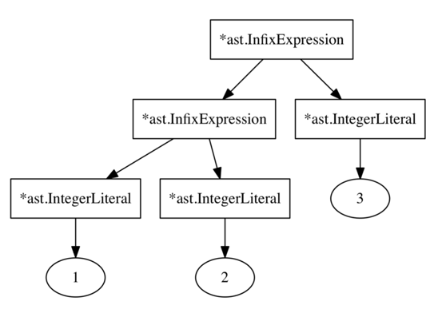

# Parser

Parser scope
- taking a list of tokens and producing a tree, Abstract Syntax Tree, whose node has type `Node`, root node is always a `Program`.
- a program is a list of statements.
- a node is either `Statement` or `Expression`

Structure
``` 
Program
    Statements
        Statement1
            Operator
            Identifier
            Expression
        Statement2
            ...
```

AST Node
- Program
- Statement
  - LetStatement
  - ConstStatement
  - ReturnStatement
- Operator
- Expression
  - Identifier
    - treated as an expression because e.g. in `let x=y;` y is a value-producing expr
  - IntegerLiteralExpression
  - BooleanExpression
  - InfixExpression
  - PrefixExpression
  - PostfixExpression


`Statement vs Expression`: here expression results in value, statement does not.
- `let x=5` or `return 5` do not produce values
- `add(5,5)` produces value -> expression
- the distinction depends on programming language
  - in Scala, function literals are expression and can be bound to a variable `val add = (a:Int, b:Int) => a + b`
  - in Java, function cannot be used as an expression

Parser Approaches
- top-down vs bottom-up parsing
  - top-down: constructing AST root node then descend
  - bottom-up: the other way around
- top-down variations
  - `recursive descent parsing/ Pratt parser` -> we write this
  - early parsing
  - predictive parsing

Pratt Parser
- to parse an expression, each operator has <= 2 parsing functions depending on type
  - infix `5 + 5`
  - prefix `--x`

Examples
- prefix expression
- infix expression
- let statement
- return statement
- function

### Expression

#### String literal expression

#### Prefix expression
``` 
-5;

tokens = [
    Operator("-"),
    IntegerLiteral(5)
]
```

#### Infix expression
``` 
1 + 2;

tokens = [
    Value(1),
    OperatorInfix("+"),
    Value(2)
]

ast = InfixExpression(
    operator="plus",
    left=IntegerLiteral(1),
    right=IntegerLiteral(2)
)

```

### Statement


ast for `let x=5;`




ast for parsing `1+2+3;`




#### let statement - variable bindings
``` 
let <identifier> = <expression>;
```

```
let x = 5;

tokens = [
    Keyword("let"),
    Identifier("x"),
    OperatorInfix("="),
    Value(5),
    Semicolon,
]

ast = Program(
  statements=[
    LetStatement(
      Name=Identifier("x"),
      Value=IntegerLiteral(5),
    )
  ]
)
```

```
let x = 5;
let y = 3;
let z = x + y;
let foobar = add(5, 5);
let barfoo = 5 * 5 / 10 + 18 - add(5, 5) + multiply(124); let anotherName = barfoo;

tokens = [
    Keyword("let"),
    Identifier("x"),
    OperatorInfix("="),
    Value(5),
    Semicolon,
    
    Keyword("let"),
    Identifier("y"),
    OperatorInfix("="),
    Value(3),
    Semicolon,
]

ast = Statement(
)
```


